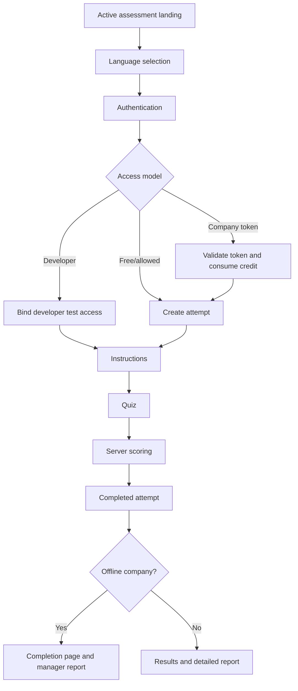
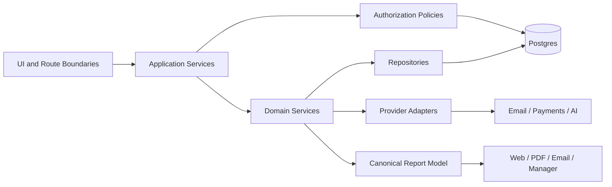

# Career Labs AI — Application Architecture

## Purpose

This document describes the current production repository and the intended architectural direction. It must be read with [PLATFORM_RULES.md](./PLATFORM_RULES.md), [DATABASE.md](./DATABASE.md), and [SECURITY.md](./SECURITY.md).

## Current architecture

Career Labs AI is a Next.js 14 modular monolith. The browser uses Supabase Auth and selected RLS-controlled data access. Trusted server components, route handlers, and server actions use server-side Supabase clients, including service-role clients for privileged operations.

```text
Participant / Manager / Administrator
                  │
          Next.js App Router
     ┌────────────┼─────────────┐
     │            │             │
 Client UI   Server Actions   API Routes
     │            │             │
     └────────────┼─────────────┘
                  │
          Domain logic (mixed today)
                  │
        Supabase Auth + Postgres
                  │
     Reports / Email / Corporate views
```

The deployment model is appropriate for current scale. The primary issue is separation inside the monolith: business rules are distributed across UI pages, helpers, server actions, database RPCs, and report renderers.

## Folder structure

```text
app/
  (site)/                    Participant-facing route group
    [slug]/                  Dynamic assessment lifecycle
    quiz/                    Shared interactive quiz
    dashboard/               Participant history
    profile/                 Participant profile
    print-report/            Legacy printable report
  admin/                     Private operational tools
  api/                       Route handlers
  company/                   Manager/HR dashboard
  reports/pdf/               Specialized PDF pages

src/
  components/                Shared and UI components
  contexts/                  Session and locale state
  data/                      Static sample data
  hooks/                     Shared hooks
  integrations/supabase/     Browser Supabase client
  lib/                       Scoring, access, reports, plans, helpers
  types/                     Shared TypeScript contracts

supabase/migrations/         Repository-tracked schema changes
tests/                       Focused regression tests
docs/architecture/           Permanent engineering reference
```

## Routing

The principal assessment routes are:

```text
/{slug}
  ├─ /login
  ├─ /start                  Legacy/parallel authentication entry
  ├─ /instructions
  ├─ /quiz                   Authorization wrapper
  ├─ /results
  ├─ /report
  ├─ /completed              Offline corporate completion
  ├─ /premium-report         SME-specific
  └─ /premium-pdf            SME-specific
```

Additional surfaces include participant dashboard/profile, company manager dashboard, administration consoles, PDF pages, health, configuration, attempt-start, report-data, and email routes.

## Server Actions

`src/lib/actions.ts` currently provides:

- Assessment lookup by slug
- Attempt validation
- Paid/developer access checks during submission
- Live question validation
- Server-side scoring
- Competency and overall result persistence

Server Actions should remain thin application boundaries over future services. They must not become a second service layer.

## Authentication

Supabase Auth supports:

- Email/password sign-up and sign-in
- OAuth in the older start flow
- Auth callback code exchange
- Generated developer-test identities and magic links

Participant profile data exists in Auth metadata, `profiles`, and attempt-time snapshots. Their ownership rules should be formalized.

## Authorization

Current access models include:

- Authenticated participant ownership, dependent on RLS and page checks
- Token/company-backed paid attempt
- Developer-test user plus signed attempt cookie
- Offline company manager token
- Shared-secret administrator session

Authorization is not yet centralized across all report and PDF surfaces. See [SECURITY.md](./SECURITY.md).

## Current reusable modules

Reusable business capabilities exist as helpers rather than a complete service layer:

- Paid MRI access helpers
- Developer test access helpers
- Offline attempt/manager access helpers
- Offline company activation/session helpers
- Server scoring action
- Recommendation and plan generators

The target services are specified in [SERVICES.md](./SERVICES.md).

## Assessment data flow

```text
Assessment row + question rows
          │
          ▼
Participant selects language and authenticates
          │
          ▼
Attempt created directly or through token/credit RPC
          │
          ▼
Questions loaded and shuffled
          │
          ▼
Original option indexes submitted
          │
          ▼
Server validates live questions and calculates scores
          │
          ▼
Attempt stores answers, competency results, overall percentage
```

## Assessment lifecycle



## Report lifecycle

```text
Authorized attempt
  → competency normalization
  → label and tier resolution
  → strengths/risks ordering
  → recommendations and treatment metadata
  → implementation-plan generation
  → web / print / PDF / email / manager renderer
```

Today, these calculations are repeated across renderers. The target is one authorized canonical report model, as described in [REPORT_ENGINE.md](./REPORT_ENGINE.md).

## Token lifecycle

### Company/team token

```text
Offline/online provisioning
  → access_tokens record
  → participant link
  → authenticated start request
  → transactional token/company/credit validation
  → attempt linked to company and access token
```

### Developer token

```text
Administrator generates test
  → random launch token
  → hash stored
  → one-time expiring launch
  → generated-user magic link
  → signed attempt cookie
```

### Manager token

```text
Company activation
  → manager token stored on company
  → dashboard URL
  → company lookup
  → company-scoped attempts and authorized report links
```

## Company lifecycle

```text
Administrator activation
  → transactional company creation
  → package and credit balance
  → employee access token
  → manager token
  → participant attempts consume credits
  → manager dashboard summarizes company results
```

## Corporate dashboard lifecycle

The current manager dashboard accepts a manager token, loads the matching company, resolves the Outdoor Sales MRI assessment, loads company attempts, calculates package/completion metrics, and links to participant reports. It is assessment- and token-specific rather than a general organization portal.

## Target architecture



Keep the modular monolith. Introduce explicit boundaries, typed contracts, versioned assessment definitions, centralized access policies, and canonical report construction before building the Control Center.

