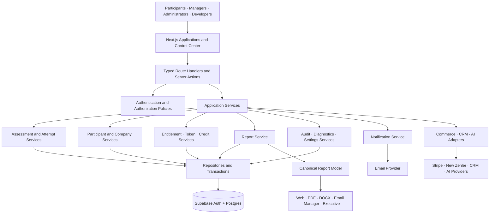
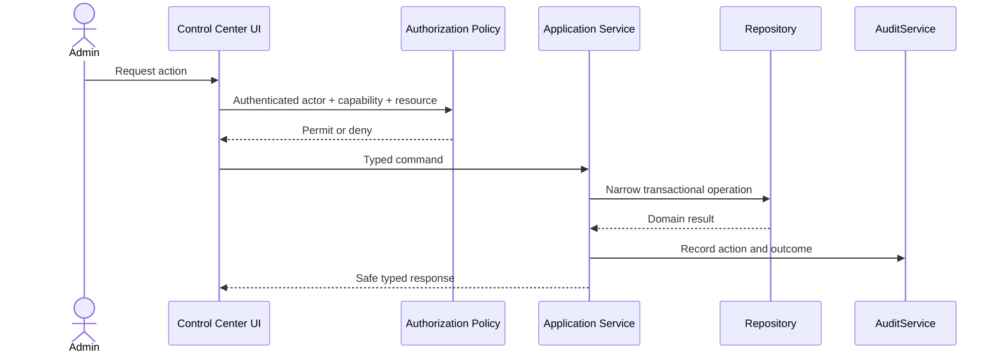

# Career Labs AI Control Center — Master Implementation Plan

## Official Implementation Contract

**Status:** Authoritative roadmap  
**Scope:** Career Labs AI Control Center and the platform foundations required to support it  
**Planning horizon:** Five years, with architecture intended to remain viable for ten years  
**Implementation state:** Specification only; no Control Center implementation is authorized by this document

This master plan consolidates the permanent architecture library and defines the sequence, boundaries, acceptance criteria, and non-goals for implementing the Career Labs AI Control Center.

It must be read with:

- [PLATFORM_RULES.md](./PLATFORM_RULES.md) — binding engineering constitution
- [AI_CONTEXT.md](./AI_CONTEXT.md) — repository and product orientation
- [ARCHITECTURE.md](./ARCHITECTURE.md) — current application architecture
- [DATABASE.md](./DATABASE.md) — repository-evidenced data model
- [SERVICES.md](./SERVICES.md) — service boundaries
- [SECURITY.md](./SECURITY.md) — security requirements
- [ASSESSMENT_ENGINE.md](./ASSESSMENT_ENGINE.md) — assessment lifecycle and scoring
- [REPORT_ENGINE.md](./REPORT_ENGINE.md) — report architecture
- [ADMIN_CONSOLE.md](./ADMIN_CONSOLE.md) — Control Center product specification
- [CODING_STANDARDS.md](./CODING_STANDARDS.md) — implementation standards
- [CHANGELOG_GUIDE.md](./CHANGELOG_GUIDE.md) — implementation handoff contract
- [RELEASE_CHECKLIST.md](./RELEASE_CHECKLIST.md) — release governance

Where another planning document conflicts with this master plan, the stricter rule applies. `PLATFORM_RULES.md` remains supreme.

---

# 1. Executive Summary

## Why the Control Center exists

Career Labs AI has evolved from an assessment application into a platform supporting multiple diagnostics, participant identities, paid and company-backed access, offline corporate activation, manager reporting, developer testing, and multiple report formats. Operational control is currently distributed across private utilities, database operations, application code, and specialized dashboards.

The Control Center will provide one governed operating interface for the platform. It will allow authorized teams to understand platform health, manage organizations and access, support participants, inspect reports, validate assessments, reconcile credits, run developer diagnostics, and eventually publish new assessment versions.

The Control Center is not simply an administration UI. It is the visible interface to a secure service architecture. Building screens before establishing authorization, identity, audit, schema knowledge, and service boundaries would reproduce the platform's current technical debt in a more powerful and therefore more dangerous form.

## Business goals

- Reduce operational dependence on engineers and direct database access.
- Support dozens of assessments without multiplying bespoke administration workflows.
- Give Career Labs AI controlled visibility into participants, companies, attempts, reports, entitlements, and credits.
- Enable reliable corporate delivery, support, and reconciliation.
- Establish the foundation for assessment publishing, CRM, enterprise analytics, and executive intelligence.
- Preserve participant trust, report confidentiality, scoring integrity, and bilingual quality as the platform grows.

## Technical goals

- Centralize authentication, authorization, and report access.
- Establish typed, testable service boundaries inside the modular monolith.
- Record administrative actions in an immutable audit trail.
- Replace raw/shared bearer access with named identities and scoped sessions.
- Create versioned assessment definitions and reproducible completed attempts.
- Create one canonical report model used by every renderer.
- Normalize tokens, credits, complimentary access, and purchases into a provider-neutral entitlement model.
- Build a permission-aware, accessible, bilingual Control Center without business logic in UI components.

## Long-term vision

Career Labs AI should become a governed capability-intelligence operating system. Deterministic assessments provide trusted evidence; reports convert evidence into action; enterprise tools organize delivery; AI explains and recommends without altering verified facts; executive intelligence aggregates authorized data with transparent limits.

The platform should remain a modular monolith until measured operational needs justify distribution. Scale must come from clear contracts and versioned data—not premature microservices.

---

# 2. Guiding Principles

## Engineering philosophy

1. Trust is the primary product invariant.
2. Security and authorization are server responsibilities.
3. Every business fact has one authoritative owner.
4. Published scoring and completed reports must remain reproducible.
5. Services own business logic; UI presents authorized view models.
6. New assessments extend a common engine rather than duplicate it.
7. The platform evolves incrementally behind characterization tests.
8. High-risk changes are observable, auditable, reversible, and deliberately released.

## Platform constitution summary

The following rules are non-negotiable:

- Never duplicate assessment lifecycle, scoring, tier, competency, or report calculations.
- Never bypass authorization for testing, previews, support, reports, or administration.
- Never treat possession of an ID as permission.
- Never place SQL, scoring, credits, entitlements, or authorization logic in UI components.
- Never use service-role access without an explicit server-side authorization decision.
- Never mutate a published assessment version silently.
- Never let payment providers directly control assessment behavior.
- Never deploy without build, type, regression, manual, security, and rollback verification.
- Never conceal a temporary exception; give it an owner and removal condition.

## Architectural philosophy

```text
Presentation
    │ consumes typed commands and view models
    ▼
Application Services
    │ orchestrate use cases
    ├─────────────► Authorization Policies
    ▼
Domain Services
    │ own business rules
    ├─────────────► Provider Adapters
    ▼
Repositories / Transaction Boundaries
    ▼
Supabase Auth + Postgres
```

- Route handlers and server actions are boundaries, not business-rule owners.
- Repositories own persistence mechanics, not policy.
- Provider adapters isolate email, payment, AI, and future integration details.
- Shared services remain framework-independent where practical.
- Service contracts return domain/API types, never raw database rows.

---

# 3. Current State

## Current application

Career Labs AI is a production Next.js 14 App Router application using React, TypeScript, Supabase Auth/Postgres, Vercel functions, Tailwind, shadcn/Radix components, Nodemailer, pdfmake, and browser-rendered print/PDF surfaces.

Explicit application support currently exists for:

- Outdoor Sales Scan
- Outdoor Sales MRI
- Sales Manager MRI
- SME Business Health MRI
- Lawyer Client Conversion MRI

The database remains authoritative for which assessments are currently active.

## Current architecture

- Dynamic participant lifecycle under `app/(site)/[slug]/`
- Shared quiz and timer/randomization logic
- Server-side submission validation and scoring
- Direct browser Supabase access for selected RLS-controlled flows
- Service-role server access for scoring, reports, administration, and corporate operations
- Transactional company credit and attempt creation RPC
- Offline company activation and manager dashboard
- Developer Test Mode with one-time launch and signed attempt access
- Multiple independent results/report/PDF implementations

## Current strengths

- Server-authoritative scoring based on live question data
- Original option index preserved through answer shuffling
- Atomic company activation and credit-backed attempt creation
- Duplicate company attempt/credit protection
- Explicit offline participant privacy behavior
- Same-company manager validation for offline reports
- Strong developer launch-token pattern: random, hashed, expiring, one-time
- English/Arabic support and RTL-aware report experiences
- Deep assessment-specific report and development-plan content
- Focused regression tests around offline and developer flows

## Current weaknesses

- Authorization is inconsistent across web, premium, print, PDF, report-data, and email surfaces.
- Some service-role reads are keyed primarily by attempt ID without consistent requester ownership.
- Manager access depends on long bearer tokens in URLs.
- Administrator identity is a shared secret rather than named users with RBAC/MFA.
- Assessment behavior is split between database configuration and scattered TypeScript branches.
- Multiple renderers independently normalize, label, tier, sort, and interpret results.
- Company, contract, entitlement, token, and credit concepts overlap.
- The database migration directory is not a complete production baseline.
- Process-local rate limiting is not reliable across distributed Vercel instances.

## Current technical debt

- Main report page exceeds 5,500 lines.
- Results, recommendation, premium report, and PDF modules are large and overlapping.
- `attempts` and `quiz_attempts` references coexist.
- `competency_results` and legacy `competency_scores` concepts coexist.
- Parallel login/start and report/PDF paths remain.
- Repeated service-role client construction and broad `select *` queries exist.
- No canonical published assessment version is visibly attached to attempts.
- No canonical report view model exists.
- Automated testing does not yet cover every assessment end to end.
- Stripe, New Zenler, DOCX, enterprise RBAC, and generalized complimentary entitlements are not implemented in this repository.

---

# 4. Target Architecture

## Platform view



## Control Center request path



## Subsystem connections

### Identity and authorization

Supabase Auth establishes identity. A future membership/RBAC model resolves platform and organization roles. Central policies authorize every Control Center command and sensitive read.

### Assessments and attempts

AssessmentService owns published versions. AttemptService binds an attempt to one version, coordinates entitlement checks, and invokes ScoringService at submission.

### Organizations and access

CompanyService owns organizations, members, teams, cohorts, and manager visibility. EntitlementService resolves access from company contracts, purchases, complimentary grants, or developer testing. TokenService provides credentials; CreditService provides atomic usage accounting.

### Reports

ReportService authorizes the requested audience and builds one canonical report model. All output adapters consume that model.

### Operations

AuditService records material actions. DiagnosticsService detects configuration and data anomalies. SettingsService supplies typed non-secret configuration. NotificationService sends authorized, template-controlled messages.

### Integrations

Commerce, CRM, training/course catalogs, and AI providers integrate through adapters. External providers never become sources of scoring or authorization truth.

---

# 5. Control Center Modules

## 5.1 Dashboard

Purpose: answer whether the platform is healthy and where action is required.

Capabilities:

- Attempts started, completed, failed, and abandoned
- Active assessments and publication warnings
- Organization and credit utilization
- Report and notification health
- Expiring entitlements/tokens/contracts
- Security events and recent audit activity
- Diagnostic exceptions requiring review

All metrics must define time range, population, assessment version, and data freshness.

## 5.2 Companies

- Organization identity and status
- Billing/operational contacts
- Contracts, packages, assessment allocations, and entitlements
- Members, managers, teams, and cohorts
- Invitations and completion tracking
- Manager visibility and consent settings
- Organization reports and exports
- Token/session rotation and revocation
- Complete audit timeline

Current offline activation becomes one controlled workflow, not a separate architecture.

## 5.3 Participants

- Permission-aware identity and attempt search
- Current profile versus immutable attempt identity snapshots
- Attempts, reports, entitlements, invitations, and consent
- Support actions with reason, authorization, and audit
- Data export, correction, retention, and deletion workflows

PII access is a separate capability from attempt/report access.

## 5.4 Reports

- Authorized participant, manager, and future executive preview
- Report and assessment version provenance
- Web/PDF/DOCX/email generation status
- Delivery history and controlled regeneration
- Content/metadata coverage diagnostics
- Access/export audit history

The module consumes ReportService and never recalculates scores or tiers.

## 5.5 Credits

- Organization balances
- Immutable ledger
- Allocations, consumption, corrections, and reconciliation
- Attempt/order/actor references
- Idempotency and anomaly detection

No balance change exists without a corresponding ledger event.

## 5.6 Tokens

- Credential type, scope, owner, fingerprint, status, expiry, and uses
- One-time reveal where required
- Rotation, revocation, and exchange into short-lived sessions
- Usage history and suspicious-pattern diagnostics

Full tokens are never returned after creation or placed in audit logs.

## 5.7 Complimentary Access

- Explicit entitlement type
- Recipient, assessment/version scope, issuer, reason, and expiry
- Remaining uses and revocation
- Developer-test distinction
- Audit history and utilization

Complimentary access replaces hidden bypasses and does not modify scoring or report rules.

## 5.8 Diagnostics

- Assessment definition and publication validation
- Question/option/score alignment
- Competency and translation coverage
- Report-provider coverage
- Attempt lifecycle anomalies
- Credit/token/entitlement reconciliation
- Provider and notification failures

Detection and repair are separate permissions. Repairs must be reversible and audited.

## 5.9 Developer Tools

- Existing Developer Test Mode
- Lifecycle simulator
- Golden report/scoring fixtures
- Feature-flag inspection
- Safe configuration health
- Request/correlation lookup
- Job inspection when background jobs exist

Developer tools never create invisible production authorization exceptions.

## 5.10 Settings

- Branding and localization defaults
- Notification templates and approved senders
- Retention/privacy configuration
- Feature flags
- Organization defaults
- Non-secret integration metadata

Secrets remain in approved secret storage and are never returned to UI.

## 5.11 Audit

- Actor, role, action, resource, organization, outcome, time, and correlation
- Before/after summary for material mutations
- Security events, exports, report access, grants, credit corrections, and publishing
- Permission-aware search and export
- Defined retention and tamper resistance

General application logs do not substitute for audit records.

## 5.12 Notifications

- Approved bilingual templates
- Authorized destinations and report links
- Email/provider status, retries, suppression, and delivery history
- Rate limiting and abuse detection
- Invitation, completion, report, security, and operational notifications

## 5.13 Future CRM

- Prospects, customers, partner organizations, contacts, opportunities, contracts, renewals, and activity
- Strict separation from participant evidence and confidential reports
- CRM role does not imply PII or report access

## 5.14 Future AI

- Permission-aware operational assistant
- Diagnostic explanation and remediation suggestions
- Assessment content/translation quality assistance
- Support drafting
- Report narrative generated only from canonical facts

AI activity must record model/prompt/version provenance where consequential and remain reviewable.

## 5.15 Executive Intelligence

- Cohort capability distributions and heat maps
- Strength/risk concentration
- Longitudinal development signals
- Completion, utilization, and data-quality context
- Privacy-threshold benchmarking
- Evidence-linked executive narrative

Executive outputs must disclose population, version, time range, missing data, and limitations.

---

# 6. Final Service Architecture

## AssessmentService

Owns assessment catalog, draft and published versions, competencies, questions, localization, timing, access metadata, publication validation, and version resolution. It does not own scoring execution, participant identity, payments, or rendering.

## AttemptService

Owns attempt creation/resume, identity binding, lifecycle status, idempotency, submission orchestration, completion, and immutable version references. It coordinates but does not duplicate ScoringService.

## ScoringService

Owns deterministic server-side answer validation, competency aggregation, overall calculation, tiers, and scoring-version compatibility. Its calculation core should be pure and framework-independent.

## ParticipantService

Owns current participant profile, preferences, consent, history, support workflows, data export, and deletion orchestration. It distinguishes mutable profile data from historical attempt snapshots.

## CompanyService

Owns organizations, members, roles, teams, cohorts, contracts, manager permissions, privacy configuration, and organization-level reporting context.

## EntitlementService

Owns provider-neutral permission to start assessments. It resolves purchases, company contracts, credits, complimentary grants, invitations, and developer access without leaking provider logic into assessment pages.

## ReportService

Owns report-access policy integration and canonical report-view-model construction, including labels, tiers, ordering, SWOT, recommendations, treatment, plan, localization, and provenance.

## CreditService

Owns allocation, atomic consumption, immutable ledger, balance reconciliation, corrections, concurrency, and idempotency.

## TokenService

Owns credential generation, hashing, scope, validation, exchange, expiry, remaining uses, rotation, revocation, and audit events.

## AuditService

Owns immutable administration and security events, permission-aware querying, retention, and export. Audit failures for high-impact mutations must fail safely according to the use case.

## DiagnosticsService

Owns publication readiness, translation/score/report coverage checks, operational anomaly detection, reconciliation checks, and safe repair planning.

## NotificationService

Owns approved templates, authorization, destination validation, delivery, retry, suppression, provider abstraction, rate limiting, and delivery history.

## SettingsService

Owns typed, version-aware, environment- and organization-scoped non-secret settings. It does not expose secrets or replace feature-flag governance.

## CommerceService

Owns orders, payment events, invoices, refunds, reconciliation, and entitlement issuance through Stripe, New Zenler, and offline adapters when implemented.

## Authorization policy layer

Owns actor/action/resource/scope/purpose decisions for participants, attempts, reports, organizations, administration, exports, diagnostics, and repairs. It is deny-by-default and shared by every output path.

---

# 7. Security Contract

## Authentication

- Participants: Supabase Auth sessions.
- Administrators: named identities with MFA/step-up authentication.
- Managers: named organization membership, with SSO support in the enterprise roadmap.
- Developer tests: explicit generated identities and one-time launches.
- Service integrations: scoped machine identities or signed provider events.

## Authorization

Every protected operation must prove:

1. Authenticated actor
2. Requested action
3. Target resource
4. Organization/assessment scope
5. Purpose or audience where relevant
6. Applicable entitlement, ownership, or role

Authorization occurs before privileged disclosure or mutation and is repeated at each server boundary.

## Permissions

Capability-based permissions include:

- `control_center.access`
- `assessment.read`, `assessment.edit`, `assessment.publish`
- `participant.read`, `participant.pii.read`, `participant.support`
- `organization.read`, `organization.manage`
- `attempt.read`, `attempt.support`
- `report.view`, `report.generate`, `report.export`
- `entitlement.read`, `entitlement.grant`, `entitlement.revoke`
- `credit.read`, `credit.adjust`
- `token.read`, `token.issue`, `token.revoke`
- `developer_test.create`
- `diagnostics.read`, `diagnostics.repair`
- `audit.read`
- `settings.manage`
- `administrator.manage`

## Administrative roles

- Super Administrator
- Platform Administrator
- Assessment Editor
- Assessment Publisher
- Support Operator
- Finance Operator
- Developer/Diagnostics Operator
- Auditor

Role bundles are conveniences. Authorization evaluates capabilities, not role-name strings.

## Manager roles

- Organization Administrator
- Organization Manager
- Cohort Manager
- Report Viewer

Manager scope is restricted to assigned organizations/cohorts and configured report visibility. Manager access never follows automatically from knowing a company or attempt identifier.

## Audit

Audit is required for:

- Administrator authentication and permission changes
- Assessment publishing/retirement
- Organization activation and contract changes
- Entitlement and token issuance/revocation
- Credit adjustments
- Participant support and PII access
- Report access, generation, and export
- Diagnostics repair
- Settings/integration changes

## Security gates before Control Center UI

- Complete schema and RLS inventory
- Central attempt/report policies
- Secured report/PDF/email endpoints
- Named admin identity and RBAC design
- Distributed abuse controls for sensitive endpoints
- Audit-event contract

---

# 8. Database Strategy

## Current database

Repository evidence includes:

- `assessments`
- `questions`
- `quiz_attempts`
- `profiles`
- `companies`
- `access_tokens`
- `credit_transactions`
- `developer_test_attempts`
- Supabase `auth.users`

An `attempts` reference exists in one route but is unverified and potentially legacy. `admin_activation_log` is proposal-only. The repository does not contain a complete production schema or RLS baseline.

## Required baseline

Before schema design:

- Export production schema without data.
- Record applied migrations.
- Inventory RLS policies, grants, functions, triggers, constraints, and indexes.
- Generate current database types.
- Document query plans for high-volume paths.
- Identify raw tokens and sensitive data.

## Future evolution

Expected concepts, subject to later design and migration approval:

- Assessment/version publication records
- Explicit attempt lifecycle and version references
- Administrator and organization memberships/roles
- Entitlements and grants
- Hashed access credentials
- Immutable credit ledger metadata
- Audit events
- Notification delivery records
- Orders/payment events when commerce is introduced

These are target concepts, not authorization to create tables.

## Migration philosophy

- Repository-tracked migrations are the only schema-change mechanism.
- Applied migrations are immutable.
- Use expand/migrate/contract for breaking changes.
- Application and schema remain backward compatible throughout rollout.
- Backfills are bounded, idempotent, observable, restartable, and reconcilable.
- Destructive changes require backup, impact analysis, explicit approval, and a compensating plan.
- RLS, grants, indexes, and generated types are part of migration review.

## Versioning

- Published assessment versions are immutable.
- Attempts reference the exact assessment and scoring versions used.
- Completed reports record report/content version and provenance.
- Historical snapshots are legitimate duplication when their immutable purpose is explicit.
- API/provider event versions are handled through typed adapters.

---

# 9. UI Strategy

## Navigation

```text
Overview
Assessments
Participants
Organizations
Reports
Access & Entitlements
Credits & Commerce
Diagnostics
Developer Tools
Security & Audit
Integrations
Settings
```

Navigation is permission-aware. Hiding an item is not authorization; server policies remain authoritative.

## Layouts

- Persistent desktop sidebar and compact responsive navigation
- Clear organization/environment context
- Page header with title, scope, actions, and breadcrumbs
- Filter/search region with shareable non-sensitive state
- Main content with loading/empty/error/unauthorized states
- Contextual detail drawer or dedicated detail route
- Explicit confirmation for destructive/high-impact actions

## Components

Reusable components should include:

- Permission-aware action controls
- Data tables with pagination, sorting, filters, and column visibility
- Search and command palette
- Metric cards with definition/freshness
- Status badges with text and color
- Audit timeline
- Diff/confirmation view for mutations
- Bilingual form controls
- Empty, error, retry, and restricted-access states
- Accessible charts and export controls

Components consume typed service results. They contain no SQL, scoring, credit, entitlement, or authorization rules.

## Design language

- Professional, calm, information-dense, and operationally clear
- Career Labs brand without decorative interference
- Consistent spacing, typography, status vocabulary, and interaction patterns
- Progressive disclosure for advanced diagnostics
- No redesign of participant reports as a side effect of Control Center work

## Accessibility

- WCAG-oriented semantic structure
- Keyboard navigation and visible focus
- Screen-reader labels and logical heading order
- Sufficient contrast
- Status never communicated by color alone
- Accessible chart summaries/tables
- Reduced-motion support where applicable
- English LTR and Arabic RTL reading order

## Responsiveness

- Desktop-first operational density with complete tablet/mobile support
- Tables adapt through priority columns, horizontal containment, or card views
- High-impact actions remain usable and safe on small screens
- No hidden critical information due to viewport size

---

# 10. Development Roadmap

## Milestone 0 — Authoritative Baseline

**Objectives**

- Capture production schema, RLS, migrations, routes, and access matrix.
- Establish golden behavior fixtures for all current assessments.
- Inventory every report, PDF, email, token, and administrator path.

**Dependencies:** None  
**Complexity:** Medium  
**Risk:** Low operational risk; high discovery importance

**Rollback strategy:** Documentation and read-only tests can be removed without runtime effect.

**Testing**

- Schema comparison
- RLS policy review
- Existing test execution
- Golden-result fixture verification
- Access-path inventory review

**Acceptance criteria**

- Production schema and policies are documented.
- Every current assessment/access/report path has an owner and test baseline.
- Unknown legacy paths are classified.

**Expected files**

- `docs/architecture/`
- `tests/fixtures/` or equivalent
- Read-only schema/type artifacts
- No business behavior changes

## Milestone 1 — Security Containment

**Objectives**

- Centralize attempt and report authorization.
- Protect web, premium, print, PDF, report-data, and email surfaces.
- Validate safe auth redirects.
- Replace weak endpoint abuse controls where necessary.

**Dependencies:** Milestone 0  
**Complexity:** High  
**Risk:** High

**Rollback strategy:** Per-surface feature flags/adapters and preservation of prior authorized behavior; never restore known unauthorized disclosure.

**Testing**

- Actor/resource authorization matrix
- Negative ID-guessing and cross-user/company tests
- Offline/developer/paid compatibility
- Email destination/link validation
- Security regression tests

**Acceptance criteria**

- Every sensitive surface proves requester permission.
- Service-role reads occur only after authorization.
- No arbitrary report/email access remains.

**Expected files**

- `src/lib/` or future `src/modules/authorization/`
- Report/PDF/email route boundaries
- Security tests
- No assessment scoring/content changes

## Milestone 2 — Platform Service Foundation

**Objectives**

- Create typed server client/repository infrastructure.
- Introduce Authorization, Assessment, Attempt, Participant, Company, Token, Credit, Audit, Diagnostics, Notification, and Settings contracts incrementally.
- Standardize safe API errors and request correlation.

**Dependencies:** Milestones 0–1  
**Complexity:** High  
**Risk:** Medium-high

**Rollback strategy:** New services initially adapt existing implementations; callers can switch back until parity is proven.

**Testing**

- Characterization and contract tests
- Existing lifecycle regression
- Error-contract tests
- Database integration tests

**Acceptance criteria**

- Business behavior remains unchanged.
- New Control Center code can use typed service contracts without direct table access.
- No duplicate sources of truth remain after each extraction.

**Expected files**

- `src/modules/*/`
- Shared server/database infrastructure
- Route/server-action adapters
- Unit/integration tests

## Milestone 3 — Named Identity, RBAC, and Audit

**Objectives**

- Introduce named administrators and organization managers.
- Add capability-based RBAC, MFA/step-up, sessions, and immutable audit events.
- Define PII/report/export permissions.

**Dependencies:** Milestone 2 and approved identity/schema design  
**Complexity:** Very high  
**Risk:** High

**Rollback strategy:** Maintain a tightly controlled break-glass administrator path during transition; revoke it after validated cutover.

**Testing**

- Full role/capability matrix
- Session expiry/revocation
- MFA/step-up tests
- Audit completeness/tamper tests
- Organization boundary tests

**Acceptance criteria**

- Routine administration no longer requires a shared secret.
- Manager access no longer depends on permanent URL tokens.
- Every material action has an attributable audit record.

**Expected files**

- Identity/authorization/audit modules
- Control Center auth layout/routes
- Reviewed migrations and RLS policies
- Security and migration tests

## Milestone 4 — Read-Only Control Center

**Objectives**

- Build permission-aware navigation and overview.
- Add read-only assessment, participant, organization, attempt, report, credit, token-fingerprint, diagnostics, and audit views.

**Dependencies:** Milestones 1–3  
**Complexity:** High  
**Risk:** Medium

**Rollback strategy:** Disable the Control Center route group without affecting participant flows.

**Testing**

- Permission-aware UI and API tests
- Pagination/filter/search tests
- PII masking
- English/Arabic, accessibility, and responsive verification
- Query performance checks

**Acceptance criteria**

- Authorized operators can diagnose common issues without database access.
- Users see only permitted modules, fields, and records.
- No Control Center component queries Supabase directly.

**Expected files**

- `app/(control-center)/control-center/`
- Domain UI/view-model modules
- Read-only service queries
- Accessibility/e2e tests

## Milestone 5 — Controlled Operations

**Objectives**

- Move offline company activation and Developer Test Mode into governed workflows.
- Add organization management, complimentary grants, token rotation/revocation, participant support, and audited credit corrections.

**Dependencies:** Milestone 4  
**Complexity:** Very high  
**Risk:** High

**Rollback strategy:** Capability-level feature flags; existing safe workflows remain until parity and reconciliation are confirmed.

**Testing**

- Idempotency/concurrency
- Permission and step-up checks
- Audit assertions
- Ledger and entitlement reconciliation
- Failure/partial-operation tests

**Acceptance criteria**

- Every mutation is authorized, validated, transactional where required, audited, and recoverable.
- No hidden complimentary or developer bypass exists.

**Expected files**

- Control Center mutation routes/actions
- Company/entitlement/token/credit services
- Audit events
- Migrations and integration tests where approved

## Milestone 6 — Canonical Assessment Registry

**Objectives**

- Define immutable assessment versions.
- Centralize competency IDs, scoring policy, localization, report provider, and publication diagnostics.
- Attach attempts to exact versions.

**Dependencies:** Milestones 0–3; golden fixtures  
**Complexity:** Very high  
**Risk:** Critical

**Rollback strategy:** Per-assessment version flags and preservation of current adapters until result/report parity is exact.

**Testing**

- Golden scoring for every assessment
- Publication diagnostics
- Historical attempt reproducibility
- English/Arabic coverage
- Cross-assessment regression

**Acceptance criteria**

- Adding an assessment does not require scattered lifecycle branches.
- Existing scores and reports remain unchanged.
- Historical attempts resolve their original version.

**Expected files**

- Assessment/scoring modules
- Versioned definition registry
- Approved schema migrations
- Golden fixtures and publishing tests

## Milestone 7 — Canonical Report Platform

**Objectives**

- Build one authorized report view model.
- Adapt web, print, PDF, email, manager, and future DOCX renderers.
- Version report content and provenance.

**Dependencies:** Milestone 6 and centralized authorization  
**Complexity:** Very high  
**Risk:** Critical

**Rollback strategy:** Renderer-by-renderer feature flags; retain old renderer until visual, factual, authorization, and localization parity is proven.

**Testing**

- Canonical fact assertions
- Visual/PDF snapshots
- Arabic font and RTL tests
- Audience-field authorization
- Historical report reproducibility

**Acceptance criteria**

- Every output agrees on scores, tiers, labels, and treatments.
- Renderers contain no report calculations or independent data access.

**Expected files**

- Report service/model/providers
- Renderer adapters
- Report authorization policies
- Golden and visual tests

## Milestone 8 — Assessment Builder and Publishing

**Objectives**

- Add draft editing, import, validation, preview, approval, publish, retire, and rollback.

**Dependencies:** Milestones 6–7, RBAC, audit  
**Complexity:** Very high  
**Risk:** Critical

**Rollback strategy:** Published versions remain immutable; rollback reactivates a previous version.

**Testing**

- Draft validation
- Permission separation between editor/publisher
- Golden preview
- Concurrent edit/version conflict
- Publish/rollback audit

**Acceptance criteria**

- A new assessment can be published without editing shared lifecycle code.
- Invalid scoring/localization/report coverage cannot be published.

**Expected files**

- Control Center assessment-builder routes/components
- AssessmentService publishing commands
- Versioning migrations
- Publication/e2e tests

## Milestone 9 — Commerce and Integrations

**Objectives**

- Introduce provider-neutral orders and entitlement issuance.
- Add Stripe, New Zenler, and offline/manual adapters only as approved.
- Implement reconciliation, refunds, and provider diagnostics.

**Dependencies:** Entitlement/Credit/Audit services  
**Complexity:** Very high  
**Risk:** Critical

**Rollback strategy:** Stop provider ingestion, preserve issued entitlements, reconcile queued/received events, and use provider-specific compensation.

**Testing**

- Signed webhook validation
- Replay, duplicate, reordering, refund, and failure tests
- Sandbox purchases
- Ledger/entitlement reconciliation

**Acceptance criteria**

- Providers cannot directly start assessments or mutate scores.
- Every financial event is idempotent, reconcilable, and audited.

**Expected files**

- Commerce/entitlement adapters
- Webhook routes
- Approved migrations
- Provider fixtures and integration tests

## Milestone 10 — Enterprise and Intelligence

**Objectives**

- Add cohorts, enterprise reporting, privacy-aware benchmarking, training/course recommendations, CRM adapters, and governed AI/executive intelligence.

**Dependencies:** Stable versions, canonical reports, organizations, consent, RBAC, audit  
**Complexity:** Very high  
**Risk:** High to critical

**Rollback strategy:** Feature-level disablement; deterministic reports remain available; generated AI output is non-authoritative.

**Testing**

- Privacy thresholds
- Aggregate correctness
- Bias/safety review
- AI grounding/provenance/fallback
- Enterprise scale and export controls

**Acceptance criteria**

- Intelligence is evidence-linked, permission-aware, transparent, and optional.
- Individual data is not exposed through small-cohort aggregation.

**Expected files**

- Analytics/intelligence modules
- Training/course catalog adapters
- CRM/AI adapters
- Privacy and evaluation tests

---

# 11. Future Vision

## AI Executive Consultant

A permission-aware executive assistant that explains verified cohort results, highlights material patterns, suggests questions and interventions, and cites the underlying canonical metrics. It does not invent scores, diagnose people, or make autonomous employment decisions.

## Training Recommendations

Competency/tier/role-aware development paths connected to measurable follow-up. Recommendations are versioned and explain why they were selected.

## Course Recommendations

Provider-neutral course catalog matching based on authorized report needs, language, role, format, and availability. Commercial sponsorship must never alter scoring or hide recommendation rationale.

## CRM

Prospects, customers, partners, contracts, opportunities, renewals, and relationship activity—kept structurally separate from participant evidence and report authorization.

## Assessment Builder

Versioned authoring for competencies, questions, scoring, localization, recommendations, reports, previews, validation, approval, publishing, retirement, and rollback.

## Enterprise Reporting

Authorized organization/cohort dashboards with distributions, completion context, capability maps, development priorities, and controlled exports.

## Analytics

Operational, product, assessment, utilization, and development analytics with stable definitions, lineage, and version comparability.

## Benchmarking

Privacy-protected comparisons using minimum cohort sizes, relevant populations, version alignment, and transparent methodology. Benchmarking is not meaningful when assessment versions or populations are incompatible.

## Predictive Intelligence

Potential future models may identify risk or development signals only after governance, consent, validation, explainability, monitoring, and bias review. Predictive output must not be presented as certainty or used as the sole basis for high-impact decisions.

---

# 12. Phase 1 Non-Goals

Phase 1 is security containment and foundation work. It will **not** build:

- The Control Center UI
- Assessment Builder
- New assessments or question content
- New scoring models or thresholds
- Redesigned participant flows or reports
- CRM
- Stripe or New Zenler integration
- AI Executive Consultant
- Training/course recommendation marketplace
- Enterprise analytics or benchmarking
- Predictive intelligence
- DOCX generation
- New manager dashboards
- Generalized organization/cohort management
- Broad database rewrites
- Microservices
- A data warehouse or external search engine

Phase 1 must preserve current business behavior while closing access risks and establishing verified baselines.

---

# 13. Success Metrics

## Foundation metrics

- 100% of production tables, RLS policies, functions, and material indexes inventoried.
- 100% of sensitive report/output routes mapped to a centralized access policy.
- 0 service-role sensitive disclosures without explicit authorization.
- Golden scoring fixtures for 100% of active assessment families.
- Reproducible end-to-end lifecycle tests for every supported access mode.

## Security metrics

- 100% of administrators and managers use named identities after cutover.
- 100% of material administrative mutations produce audit events.
- 0 full bearer tokens in logs or audit records.
- 100% of high-impact roles protected by MFA/step-up requirements.
- Negative authorization coverage for every protected resource class.

## Control Center metrics

- At least 90% of routine support/operations cases resolved without direct database access.
- 100% of Control Center queries use service contracts rather than UI database access.
- Core list pages meet agreed latency targets with pagination at expected production volume.
- WCAG-oriented keyboard, contrast, labeling, and RTL acceptance checks pass.
- English and Arabic critical workflows have parity.

## Platform quality metrics

- One canonical tier/scoring implementation per version.
- One canonical report model per completed attempt/audience.
- New assessment publication requires no shared lifecycle duplication.
- Credit ledger reconciles to balances with zero unexplained variance.
- Provider events are idempotent with zero duplicate entitlement issuance.

## Delivery metrics

- 100% of releases use the official release checklist.
- 100% of implementation handoffs use the changelog template.
- High-risk releases have verified rollback and named approval.
- Production incidents produce reviewed corrective actions.

---

# 14. Risks

## Technical risks

### Hidden production schema/RLS differences

The repository is not a complete schema baseline. Designing against assumptions could break access or data integrity.

**Mitigation:** Milestone 0 precedes schema or Control Center work.

### Authorization regression

Centralizing inconsistent access paths can accidentally block legitimate offline, corporate, paid, or developer flows.

**Mitigation:** Access matrix, negative tests, adapters, and phased surface cutover.

### Historical result drift

Extracting scoring/report logic without versioning can change old reports.

**Mitigation:** Golden fixtures, immutable versions, and renderer-by-renderer parity.

### Large-file refactoring risk

Report and results behavior is concentrated in large files with intertwined content and UI.

**Mitigation:** Characterize first, extract one source at a time, preserve old renderers until parity.

### Data migration and token conversion

Raw tokens and overlapping identity/access models complicate migration.

**Mitigation:** Expand/migrate/contract, dual-read transition where necessary, rotation plans, reconciliation.

### Performance degradation

An administration UI can introduce broad queries and expensive aggregations.

**Mitigation:** Narrow view models, pagination, query plans, async aggregation only when measured.

## Business risks

### Scope expansion before foundations

Pressure to show UI quickly may bypass security and service prerequisites.

**Mitigation:** Treat milestone dependencies as release gates.

### Undefined privacy expectations

Participant and manager expectations may differ regarding report visibility.

**Mitigation:** Approve consent, manager visibility, retention, and export policy before enterprise reporting.

### Assessment governance

Without named content owners and publishing approvals, the builder could accelerate inconsistent assessments.

**Mitigation:** Editor/publisher separation, diagnostics, immutable versions, business approval.

### Payment/entitlement ambiguity

Tokens, credits, external purchases, and complimentary access can diverge.

**Mitigation:** Provider-neutral entitlement model and reconciliation before commerce integration.

### AI trust and liability

Generated narrative may be mistaken for validated assessment fact or employment guidance.

**Mitigation:** Clear labeling, grounding, provenance, human review, deterministic fallback, prohibited-use policy.

### Operational adoption

A Control Center that does not match real workflows may cause teams to continue direct database operations.

**Mitigation:** Read-only operational discovery, measured support use cases, progressive controlled mutations.

---

# 15. Final Recommendation

## What I would build first

As Chief Software Architect, I would not begin with dashboard components. I would begin with the authoritative production schema/RLS inventory, access matrix, and golden assessment fixtures. Next I would centralize report/attempt authorization and secure every privileged output path. Then I would introduce typed service contracts and named administrator identity with RBAC, MFA, and audit.

Only after those foundations pass production-equivalent tests would I build the read-only Control Center. Read-only operations would validate the information architecture, permission model, and service queries before any high-impact mutation is exposed.

## What I would never compromise

- Server-side scoring integrity
- Participant privacy and explicit report authorization
- Historical reproducibility of scores and reports
- Immutable, attributable administrative audit
- Atomic credit/entitlement accounting
- English/Arabic quality and accessibility
- Separation between deterministic evidence and generated AI interpretation
- Rollback and reconciliation for high-risk releases

## Architectural mistakes to avoid

- Building the Control Center directly on tables from UI components
- Treating hidden navigation as authorization
- Copying existing assessment/report pages for every new diagnostic
- Rewriting the entire platform before characterization tests exist
- Introducing microservices before internal domain boundaries are stable
- Letting Stripe, New Zenler, CRM, or AI providers become business-rule authorities
- Storing new permanent bearer credentials raw or placing them in URLs
- Mutating published assessment content without versioning
- Creating a second report calculation for executive or AI outputs
- Combining security remediation, redesign, and business-rule changes in one release

## Technical debt to pay first

1. Inconsistent report/PDF/email authorization
2. Missing production schema and RLS baseline
3. Shared administrator secret and manager URL-token identity
4. Duplicated report calculations and authorization
5. Missing assessment/report versioning
6. Distributed hard-coded assessment detection and competency mappings
7. Overlapping token, credit, company, and entitlement semantics
8. Legacy `attempts`, report, PDF, and start-flow paths
9. Broad queries and repeated service-role client construction
10. Incomplete executable regression coverage

## Five-year architectural position

Career Labs AI should remain one deployable platform with strong internal modules. The Control Center should be a consumer of those modules, not their owner. Assessment growth should happen through versioned publishing; report growth through canonical models and renderers; commercial growth through entitlements and provider adapters; enterprise growth through named identities, organization boundaries, and privacy-aware analytics; AI growth through grounded, governed interpretation.

The correct first visible deliverable is not a dashboard. It is a platform where a dashboard can be built without acquiring dangerous power through duplicated logic, direct data access, or inconsistent authorization.

---

## Contract Governance

- Every milestone requires a scoped implementation plan and approval.
- Every implementation handoff follows [CHANGELOG_GUIDE.md](./CHANGELOG_GUIDE.md).
- Every production release follows [RELEASE_CHECKLIST.md](./RELEASE_CHECKLIST.md).
- Exceptions require a written decision record under [PLATFORM_RULES.md](./PLATFORM_RULES.md).
- This master plan must be updated when approved architecture decisions materially change milestone dependencies, security boundaries, or the target service model.
