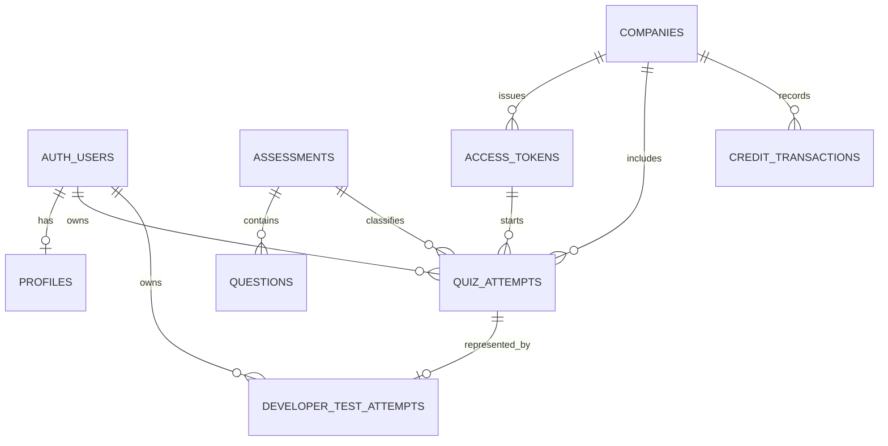

# Career Labs AI — Database Reference

## Scope and evidence

This document records tables and fields evidenced by repository migrations or application queries. The migration directory is not a complete production baseline, and no live schema export was available during documentation. Unverified constraints, RLS policies, and columns are not presented as facts.

Before database work, obtain a production schema-only export, generated Supabase types, applied-migration history, RLS policy inventory, and representative query plans.

## Relationship overview

Relationships without visible foreign-key definitions are logical relationships inferred from application behavior.

## `assessments`

**Purpose:** Catalog and configure assessments.

Observed columns:

- `id`, `slug`, `status`, `type`, `price`
- `title_en`, `title_ar`, `name_en`, `name_ar`
- `num_questions`, `timer_minutes`
- `competency_ids`, `config`
- `pdf_template`, `upsell_to`, `created_at`

Business rules:

- Participant entry requires an active assessment.
- Developer Test Mode permits a defined subset of active paid MRIs.
- Assessment ID and slug must resolve consistently.

Recommended verification:

- Unique index on `slug`
- Constraints for status/type/language-dependent content
- Versioning and immutable publication model

## `questions`

**Purpose:** Store bilingual questions, answer options, scoring, and competency assignment.

Observed columns:

- `id`
- `assessment_id`; legacy client fallback also references `assessmentId`
- `competency_id`
- `question_en`, `question_ar`
- `options_en`, `options_ar`
- `options_scores`
- `correct_answer_index`
- `created_at`

Business rules:

- Submitted questions must belong to the attempt assessment.
- Option indexes must exist in the question's live option and score arrays.
- Competency and score are server-resolved.
- Question and answer display order may be shuffled without changing original option identity.

Recommended verification:

- Index on `(assessment_id, created_at)`
- Foreign key to `assessments`
- Constraints or publication validation ensuring aligned bilingual option and score arrays
- Assessment-version linkage

## `quiz_attempts`

**Purpose:** Represent an assessment attempt and its result snapshot.

Observed columns:

- `id`, `assessment_id`, `language`
- `full_name`, `company`, `user_email`, `user_id`
- `total_questions`, `score`, `total_percentage`
- `answers`, `competency_results`
- Legacy PDF code also references `competency_scores`
- `company_id`, `access_token_id`
- `is_developer_test`
- `created_at`, `completed_at`

Business rules:

- An attempt is bound to one assessment.
- Paid MRIs require token, company, or valid developer-test backing.
- Submitted attempts cannot be submitted again.
- Company token flow prevents duplicate credit consumption for the same company, assessment, and normalized participant email.
- Completed results are treated as report snapshots.

Risks and recommendations:

- Completion is inferred from several fields; introduce an explicit lifecycle status in a future version.
- Distinguish immutable attempt-time identity from mutable participant profile.
- Version assessment, scoring, and report behavior.
- Add indexes for user history and company/assessment dashboards.
- Define JSON schemas for answers and competency results.

## `profiles`

**Purpose:** Store participant profile information associated with Supabase Auth identity.

Observed columns:

- `id`, `full_name`, `first_name`, `last_name`, `company`

The application also stores name/company in Auth metadata and attempts. The intended rule should be:

- `profiles` represents current participant profile.
- Attempt identity fields represent immutable submission-time snapshots.

The exact foreign key and RLS policies require schema verification.

## `companies`

**Purpose:** Represent corporate customers, credit balance, package allocation, and manager access.

Observed columns:

- `id`, `name`, `billing_email`
- `credits_balance`, `package_size`
- `manager_token`
- `is_offline_activated`
- `created_at`

Verified index:

- Unique partial index on non-null `manager_token`

Business rules:

- Offline activation creates a company with matching package size and credit balance.
- Equivalent normalized company name and billing email are rejected during offline activation.
- Offline activation currently supports Outdoor Sales MRI only.

Recommendations:

- Separate organization, contract/package, entitlement, and manager identity.
- Hash/rotate manager credentials.
- Introduce organization members and roles.

## `access_tokens`

**Purpose:** Grant company-linked access to an assessment.

Observed columns:

- `id`, `company_id`, `token_string`
- `assessment_type`
- `is_used`, `used_by_email`
- `expires_at`

Business rules:

- Token must exist, be unexpired, and match the assessment when scoped.
- Token's company must exist and have available credits.
- Current behavior resembles a reusable company/master token despite single-use-oriented column names.

Recommendations:

- Define token type and semantics explicitly.
- Store hashes instead of reusable raw tokens.
- Add scope, issued-by, revoked-at, rotation, and usage policy.

## `credit_transactions`

**Purpose:** Record changes to company credits.

Observed columns:

- `company_id`, `amount`, `description`

The complete schema is not present. Credit consumption is inserted transactionally with attempt creation.

Recommendations:

- Treat the ledger as immutable.
- Add stable event type, attempt/order reference, actor, idempotency key, balance-after, and timestamp.
- Reconcile `companies.credits_balance` against the ledger.

## `developer_test_attempts`

**Purpose:** Track administrator-generated developer test identities, attempts, and one-time launch links.

Verified columns:

- `id`
- `assessment_id`, `assessment_slug`, `language`
- `participant_email`, `auth_user_id`
- `attempt_id`
- `launch_token_hash`, `launch_expires_at`, `used_at`
- `created_at`

Verified constraints and controls:

- Assessment foreign key
- Auth user foreign key
- Unique attempt and launch-token hash
- Index on descending creation time
- RLS enabled
- Direct anonymous and authenticated access revoked
- Service-role-only RPC creation

## `auth.users`

**Purpose:** Supabase-managed user identity.

Referenced through authentication APIs and developer-test foreign keys. The application uses email, user ID, and metadata. Supabase owns this schema.

## `attempts`

`app/api/report-data/route.ts` references an `attempts` table, while the production application otherwise uses `quiz_attempts`. Its existence and purpose are unverified. Treat this reference as legacy or suspect until the production schema is inspected.

## Proposed-only table

`admin_activation_log` exists only in `docs/admin_activation_log_PROPOSAL.sql`. It is not a migrated table and must not be described as deployed.

## Existing database functions

### `start_assessment_with_credit`

- Validates and locks token/company records
- Resolves active assessment
- Prevents duplicate charge/attempt
- Checks and deducts credit
- Records credit transaction
- Creates company-linked attempt

The repository file is named as a backup rather than a normal ordered migration; production application status must be verified.

### `activate_offline_company`

- Validates company, email, package, assessment, and expiry
- Serializes duplicate name/email activation
- Creates company, manager token, and employee token atomically
- Marks the company as offline activated
- Restricted to service role

### `create_developer_test_attempt`

- Validates supported active assessment and language
- Creates developer quiz attempt and launch record atomically
- Links generated Auth user and hashed launch token
- Restricted to service role

## Index and RLS documentation gap

Only a subset of indexes and RLS policies is visible. No schema or policy change should be designed from this document alone. See [SECURITY.md](./SECURITY.md) and [RELEASE_CHECKLIST.md](./RELEASE_CHECKLIST.md) before database-related releases.

