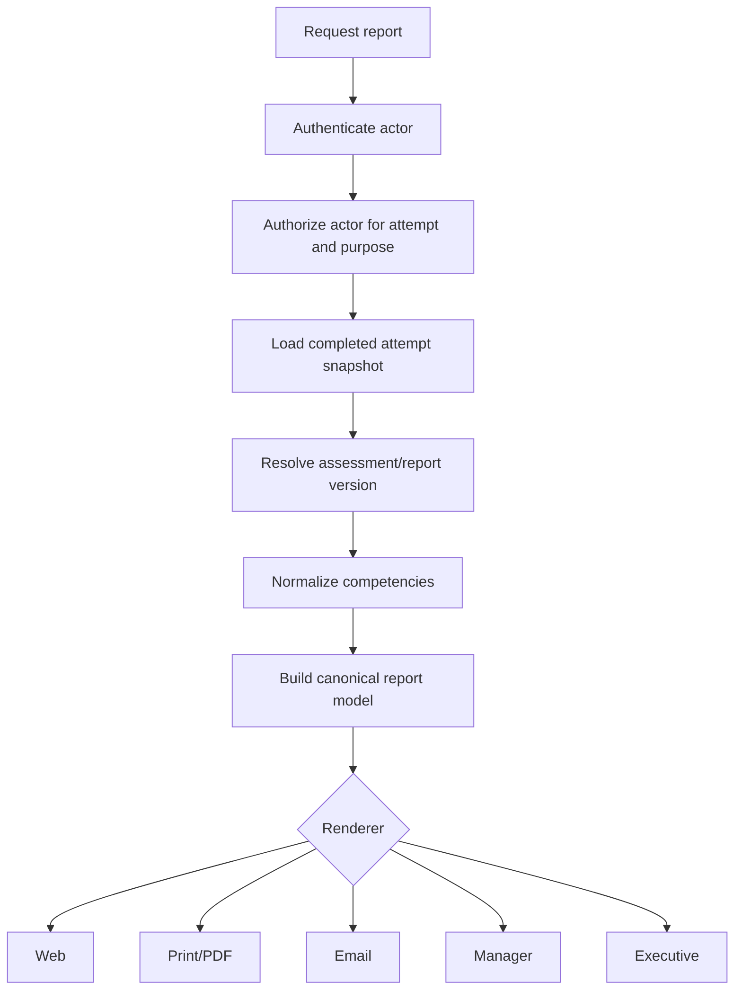

# Career Labs AI — Report Engine

## Purpose

The report engine turns an authorized completed attempt into consistent participant, manager, print, PDF, and future executive outputs. All report surfaces must obey [PLATFORM_RULES.md](./PLATFORM_RULES.md) and [SECURITY.md](./SECURITY.md).

## Current report sources

- Attempt `competency_results` and `total_percentage`
- Attempt identity snapshot and participant profile
- Assessment configuration and competency labels
- Shared recommendation profiles
- Assessment-specific treatment metadata
- Sales Manager, SME, Lawyer, and Outdoor Sales plan generators

## Current report surfaces

- Results summary client
- Main dynamic detailed report
- Outdoor Sales Scan approved report
- SME premium report
- SME premium PDF
- Legacy print report
- MRI PDF page
- Scan PDF page
- Backup/legacy report implementations
- Email containing a report link
- Company manager dashboard report links

## Report generation lifecycle



Today, authorization and model construction are not fully centralized; several renderers repeat calculations.

## Report calculations

Current report logic includes:

- Percentage clamping
- Tier classification
- Competency label resolution
- Strength/weakness ordering
- SWOT grouping
- Assessment-specific commercial meaning
- Detailed treatment selection
- Recommendations, field drills, and longer plans
- Identity extraction from attempt/profile/Auth data

These facts must be built once in a canonical `ReportViewModel`.

## Target canonical model

```text
ReportViewModel
  report and assessment version
  authorized audience and purpose
  participant snapshot
  organization context
  completion metadata
  overall result and tier
  ordered competency results
  strengths, risks, and SWOT
  treatment priorities
  recommendations
  implementation plan
  localization and branding
  provenance and generated-at metadata
```

Renderers may format or omit authorized fields, but must not recalculate them.

## Authorization

Report access must be centralized and evaluate:

- Current actor identity
- Attempt ownership
- Assessment match
- Company membership/manager permission
- Token or entitlement scope where applicable
- Developer-test ownership
- Offline-company privacy behavior
- Requested audience and output purpose

Possessing an attempt ID or proving that an attempt was paid is insufficient by itself.

## Web rendering

Use server components for authorized model loading and large static report sections. Client components should handle only interaction such as print, copy, navigation, and presentation state.

## PDF strategy

Current PDF behavior spans React-rendered pages, print views, and pdfmake. The future strategy should:

- Authorize before generation.
- Consume the canonical report model.
- Use one supported rendering pipeline per output class.
- Embed required Arabic fonts.
- Produce deterministic filenames and metadata.
- Record generation status without exposing private URLs.
- Move expensive generation to background jobs only when measured volume requires it.

Legacy PDF paths should not be removed until content and authorization parity are proven.

## DOCX strategy

No DOCX generation is currently implemented. A future DOCX renderer should be an adapter consuming the canonical report model. It must preserve bilingual layout, branded styles, tables, page breaks, and authorized field selection. DOCX generation must never query the database independently.

## Manager reports

Manager reports require a distinct authorized audience context. They may include participant-level or aggregate information only according to organization permissions and participant consent. Manager views should use named identities and auditable sessions rather than permanent query-string bearer tokens.

## Future executive reports

Executive reporting should aggregate authorized cohort data and include:

- Distribution and coverage, not only averages
- Capability heat maps
- Strength/risk concentration
- Cohort comparison with minimum-group privacy thresholds
- Completion and data-quality context
- Time/version comparability
- Clear prohibition on using preliminary assessments as sole employment decisions

## Future AI reports

AI may provide personalized explanations, coaching questions, and executive narrative, subject to these rules:

- Deterministic scores and canonical facts are immutable inputs.
- AI output is clearly identified as generated interpretation.
- Model, prompt, source report version, and generation time are recorded where consequential.
- Sensitive data is minimized and authorized.
- Unsupported claims, diagnosis, and discriminatory inference are prohibited.
- Users can fall back to deterministic reports if AI generation fails.

## Current limitations

- Multiple renderers rebuild the same facts.
- Authorization differs between surfaces.
- The main report page contains extensive business content and UI.
- PDF strategies overlap.
- Email delivery sends links rather than a governed notification/report workflow.
- Historical report-version reproducibility is not explicit.

## Required direction

1. Centralize report authorization.
2. Characterize existing output with golden fixtures.
3. Build one canonical report model.
4. Adapt existing renderers incrementally.
5. Version report content/providers.
6. Add generation/delivery audit and diagnostics.

